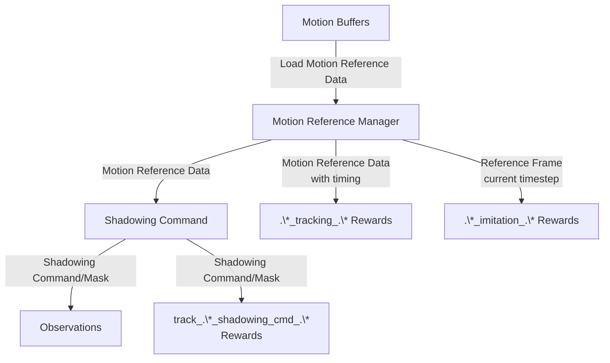
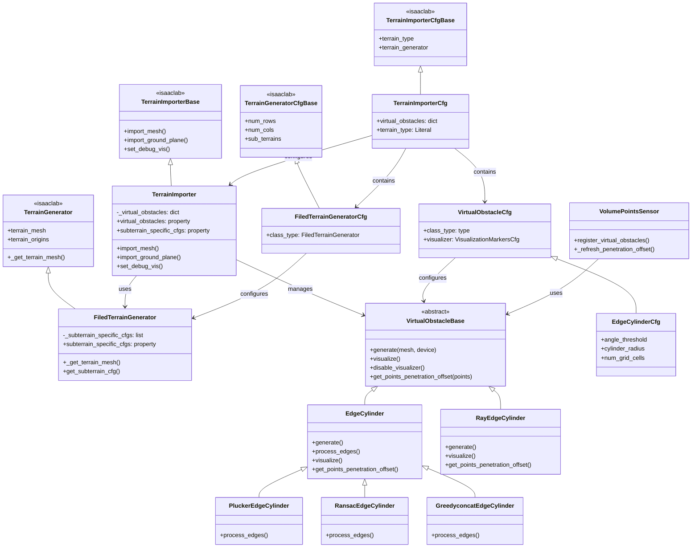

# 文档与核心概念

## Monitor（监视器）

Monitor 是一种环境组件，用户可以用它存储仿真状态，并将其绘制到 tensorboard 中。

---

## Multi Reward Manager（多奖励管理器）

多奖励管理器是一种替代默认 reward manager 的环境组件。它允许用户定义多个奖励组，用于 advantage-mixing / multi-critic RL。

### 示例配置

```python
from instinctlab.managers import MultiRewardCfg
from isaaclab.managers import RewardTermCfg as RewTermCfg
from isaaclab.managers import SceneEntityCfg
from isaaclab.utils import configclass
import instinctlab.envs.mdp as instinct_mdp
import isaaclab.envs.mdp as mdp

# Define individual reward terms
@configclass
class RewardsCfg:
    # Imitation rewards (motion matching)
    base_position_imitation_gauss = RewTermCfg(
        func=instinct_mdp.base_position_imitation_gauss,
        weight=0.5,
        params={"std": 0.3},
    )
    base_rot_imitation_gauss = RewTermCfg(
        func=instinct_mdp.base_rot_imitation_gauss,
        weight=0.5,
        params={"std": 0.4, "difference_type": "axis_angle"},
    )
    link_pos_imitation_gauss = RewTermCfg(
        func=instinct_mdp.link_pos_imitation_gauss,
        weight=1.0,
        params={
            "combine_method": "mean_prod",
            "in_base_frame": False,
            "in_relative_world_frame": True,
            "std": 0.3,
        },
    )

    # Regularization rewards
    action_rate_l2 = RewTermCfg(func=mdp.action_rate_l2, weight=-0.1)
    joint_limit = RewTermCfg(
        func=mdp.joint_pos_limits,
        weight=-10.0,
        params={"asset_cfg": SceneEntityCfg("robot", joint_names=[".*"])},
    )
    undesired_contacts = RewTermCfg(
        func=mdp.undesired_contacts,
        weight=-0.1,
        params={
            "sensor_cfg": SceneEntityCfg("contact_forces", body_names=[".*"]),
            "threshold": 1.0,
        },
    )

# Define reward groups (must inherit from MultiRewardCfg)
@configclass
class RewardGroupsCfg(MultiRewardCfg):
    # Single reward group containing all terms
    rewards = RewardsCfg()

    # Optional: Define multiple groups for multi-critic RL
    # rewards_group_1 = RewardsCfg()  # First critic
    # rewards_group_2 = RewardsCfg()  # Second critic

# In your environment configuration
@configclass
class EnvCfg(InstinctLabRLEnvCfg):
    rewards: RewardGroupsCfg = RewardGroupsCfg()
    # ... other configs ...
```

**要点：**
- 每个奖励组都是一个包含 `RewardTermCfg` 实例的配置类
- `MultiRewardManager` 会为每个组分别计算奖励
- 仅当 `rewards` 配置是 `MultiRewardCfg` 实例时，才会使用 `MultiRewardManager`。
- 返回一个形状为 `(num_envs, num_groups)` 的 dict，用于 multi-critic RL
- 每个组支持 `combine_method`：`"sum"`（默认）或 `"prod"`，用于组合各项

---

## Motion Reference（运动参考）

总体而言，数据流设计如下：



### Motion Reference Manager（运动参考管理器）
- 运动参考管理器是一个继承自 `Sensor` 的场景实体，为机器人提供运动参考数据。

- 它还管理多个 motion buffer（运动缓冲区），这些缓冲区可以来自文件，也可以生成。

- 它还提供将运动轨迹分布到不同进程的功能。

### Motion Reference Data（运动参考数据）
- 运动参考数据是一种存储运动参考数据的数据结构，它表示机器人应当达到的预期未来运动。

- 运动参考数据包含一个运动（frame）序列。你可以设置每一帧的间隔。如果将 `data_start_from` 设为 `"current_time"`，运动参考数据将作为通用的常规运动跟踪设置。

### Motion Reference Frame（运动参考帧）
- 运动参考帧是运动参考数据中的单个帧。它包含机器人在每个当前时间步的预期状态。

- 为了复用数据结构，运动参考帧始终具有长度为 1 的时间维度。

### Motion Buffer（运动缓冲区）
- motion buffer 是运动数据的文件处理器。基本功能实现是 `motion_reference.motion_files.amass_motion:AmassMotion`。

- 关于支持的文件格式，请阅读 `motion_reference.motion_files.amass_motion:AmassMotion._load_motion_sequences` 和 `motion_reference.motion_files.amass_motion:AmassMotion._read_motion_file` 的源码。

- 推荐使用名称以 `retargeted.npz` 结尾的重定向（retargeted）运动文件。

### Shadowing Command（影子指令）
- shadowing command 是机器人应当遵循的指令。它通常由运动参考数据生成。

- 每当运动参考数据更新时，每个 shadowing command 都必须（MUST）立即更新。

### Imitation（模仿）
- Imitation 以及名称匹配 `.*_imitation_.*` 的奖励表示：无论运动参考数据如何设置，机器人都应在每个时间步关注该运动。

### Tracking Motion Reference Data（跟踪运动参考数据）
- 对于 Tracking 以及名称匹配 `.*_tracking_.*` 的奖励，它表示机器人只应在达到预期到达时间时才关注该运动。例如，如果预期到达时间是未来的 1 秒，那么机器人只应在 1 秒过后才关注该运动。

- 注意：这是一个历史遗留问题——在 IsaacLab 中，以 `track` 开头的奖励计算的是机器人当前状态与指令状态之间的误差。

### Track Shadowing Command（跟踪影子指令）
- Shadowing 以及名称匹配 `track_.*_shadowing_cmd_.*` 的奖励表示：机器人应只专注于满足 shadowing command。即使 shadowing command 可能扭曲运动参考数据，机器人也应遵循该 shadowing command。


### 示例配置

#### Motion Reference Manager 配置

```python
from instinctlab.motion_reference import MotionReferenceManagerCfg
from instinctlab.motion_reference import AmassMotionCfgBase

# Configure motion buffer (e.g., AMASS dataset)
class AMASSMotionCfg(AmassMotionCfgBase):
    path = "~/Datasets/AMASS_dataset"
    motion_bin_length_s = 1.0
    frame_interval_s = 0.1
    env_starting_stub_sampling_strategy = "concat_motion_bins"

# Configure motion reference manager and put it in SceneCfg
motion_reference_cfg = MotionReferenceManagerCfg(
    prim_path="{ENV_REGEX_NS}/Robot/torso_link",
    robot_model_path="path/to/robot.urdf",
    reference_prim_path="/World/envs/env_.*/RobotReference/torso_link",
    link_of_interests=[
        "pelvis", "torso_link",
        "left_shoulder_roll_link", "right_shoulder_roll_link",
        "left_elbow_link", "right_elbow_link",
        # ... more links
    ],
    frame_interval_s=0.1,  # 10 Hz frame rate
    update_period=0.02,     # Update every 0.02s (50 Hz)
    num_frames=10,          # Look ahead 10 frames (1 second)
    data_start_from="current_time",  # Start from current timestep
    motion_buffers={
        "AMASSMotion": AMASSMotionCfg(),
    },
)
```


#### 用于重置 motion reference manager 的终止项
**注意：你使用的每个 motion reference manager 都必须应用此终止项。**

```python
from isaaclab.managers import TerminationTermCfg

# Add this to your termination cfg
class TerminationsCfg:
    motion_reference_exhausted = TerminationTermCfg(
        func=instinct_mdp.dataset_exhausted,
        params={
            "reference_cfg": SceneEntityCfg("motion_reference"),
            # "reset_without_notice": True,
            #### If True, this termination term will only reset the exhausted env in the motion reference manager, but not return any True to reset the environment.
        },
    )
```


#### Shadowing Command 配置

```python
from instinctlab.envs.mdp import PoseRefCommandCfg, JointPosRefCommandCfg
from isaaclab.managers import SceneEntityCfg

# Base pose reference command (position + orientation)
pose_ref_command = PoseRefCommandCfg(
    motion_reference=SceneEntityCfg("motion_reference"),
    asset_cfg=SceneEntityCfg("robot"),
    anchor_frame="robot",  # Reference in robot's local frame
    rotation_mode="axis_angle",  # Use axis-angle representation
    realtime_mode=0,  # No real-time updates
    current_state_command=False,  # Don't include current state
)

# Joint position reference command
joint_pos_ref_command = JointPosRefCommandCfg(
    motion_reference=SceneEntityCfg("motion_reference"),
    asset_cfg=SceneEntityCfg("robot"),
    current_state_command=True,  # Include current joint positions
)
```

#### 奖励配置示例

```python
from instinctlab.envs.mdp import RewTermCfg
from isaaclab.managers import SceneEntityCfg
import instinctlab.envs.mdp as instinct_mdp


@configclass
class RewardsCfg:
    # Tracking reward - checks timing
    base_position_tracking = RewTermCfg(
        func=instinct_mdp.base_position_tracking_gauss,
        params={
            "asset_cfg": SceneEntityCfg("robot"),
            "reference_cfg": SceneEntityCfg("motion_reference"),
            "check_at_keyframe_threshold": -1,  # Check at expected time
            "tracking_sigma": 0.2,
        },
    )

    # Imitation reward - checks every timestep
    joint_pos_imitation = RewTermCfg(
        func=instinct_mdp.joint_pos_imitation_gauss,
        params={
            "asset_cfg": SceneEntityCfg("robot"),
            "reference_cfg": SceneEntityCfg("motion_reference"),
            "std": 0.7,
            "masked": True,  # Only compute for unmasked joints
        },
    )

    # Shadowing command reward - tracks command only
    track_shadowing_cmd = RewTermCfg(
        func=instinct_mdp.track_pose_ref_shadowing_cmd_gauss,
        params={
            "command_cfg": SceneEntityCfg("pose_ref_command"),
            "asset_cfg": SceneEntityCfg("robot"),
        },
    )
```

#### 与预定义地形网格配置进行匹配

```python
from instinctlab.terrains import MotionMatchedTerrainCfg

# Add this to your event cfg
class EventsCfg:
    match_motion_ref_with_scene = EventTermCfg(
        func=instinct_mdp.match_motion_ref_with_scene,
        mode="startup",
        params={
            "motion_ref_cfg": SceneEntityCfg("motion_reference"),
        },
    )

```
---

## Virtual Obstacles（虚拟障碍物，位于地形中）

虚拟障碍物是地形特征（通常是锐利边缘）的几何表示，它们由地形网格生成，并用于传感器中的碰撞检测和穿透计算。它们使机器人能够感知并避开危险的地形特征，而无需在仿真中显式地设置碰撞几何体。

### 类层次结构与关系

下图展示了类继承与组合关系：



### 自定义 Terrain Importer

`TerrainImporter` 类扩展了 IsaacLab 的基础 terrain importer，以增加对虚拟障碍物的支持。主要特性包括：

- **虚拟障碍物管理**：在其配置（`virtual_obstacles`）中接受一个虚拟障碍物配置字典。每个虚拟障碍物在 terrain importer 初始化时被实例化。

- **自动生成**：当导入地形网格时（通过 `import_mesh`），所有已配置的虚拟障碍物都会自动从地形网格生成。生成发生在网格导入模拟器之前，因此虚拟障碍物在需要时可以先修改网格。

- **访问接口**：提供一个 `virtual_obstacles` 属性，返回所有虚拟障碍物实例的字典，使传感器和其他组件可以访问它们。

- **可视化支持**：将虚拟障碍物可视化与 terrain importer 的调试可视化系统集成。启用调试可视化时，所有虚拟障碍物都会被可视化；禁用时，其可视化器会被隐藏。

- **Hacked Generator 支持**：支持一个特殊的 `"hacked_generator"` 地形类型，允许自定义地形生成工作流，同时保持与 IsaacLab 的 terrain importer 接口的兼容性。

- **子地形配置访问**：通过 `subterrain_specific_cfgs` 属性提供对子地形特定配置的访问，该属性在可用时委托给 terrain generator。

### 自定义 Terrain Generator

`FiledTerrainGenerator` 类扩展了 IsaacLab 的 `TerrainGenerator`，以增强对子地形特定配置的访问：

- **配置跟踪**：拦截地形网格生成过程（`_get_terrain_mesh`），记录并存储每个子地形的具体配置。这包括原始配置以及生成期间所做的任何修改（例如 difficulty 和 seed 值）。

- **子地形访问**：提供两种访问子地形配置的方法：
  - `subterrain_specific_cfgs`：返回所有子地形配置的列表，按行和列索引（访问方式：`configs[row_id * num_cols + col_id]`）。
  - `get_subterrain_cfg(row_ids, col_ids)`：通过行和列索引获取特定子地形的配置。既支持单个索引，也支持基于 tensor 的批量查询。

- **使用场景**：当你需要根据机器人所在的特定子地形来查询或修改地形属性时，此接口特别有用，可实现地形感知行为和课程学习（curriculum learning）。

### Virtual Obstacle（虚拟障碍物）

虚拟障碍物是可以从地形网格生成的抽象几何表示。它们为传感器提供碰撞检测和穿透计算能力。

- **基础接口**：`VirtualObstacleBase` 抽象类定义了所有虚拟障碍物必须实现的核心接口：
  - `generate(mesh, device)`：从地形网格生成虚拟障碍物几何体。
  - `visualize()`：在仿真中可视化虚拟障碍物（通常以标记（marker）形式）。
  - `disable_visualizer()`：隐藏可视化。
  - `get_points_penetration_offset(points)`：为给定点计算穿透偏移，返回从障碍物表面指向这些点的向量（供传感器用于碰撞检测）。

- **边缘检测实现**：目前，虚拟障碍物主要使用边缘检测算法生成。系统提供了多种边缘检测变体：
  - **EdgeCylinder**：基类，使用面相邻角检测网格中的锐利边缘。超过可配置角度阈值的边缘会被识别并以圆柱体表示。
  - **PluckerEdgeCylinder**：使用 Plücker 坐标合并共线的边缘段，减少边缘表示中的冗余。
  - **RansacEdgeCylinder**：使用 RANSAC 算法结合 DBSCAN 聚类，将线段拟合到边缘点，对噪声具有鲁棒性。
  - **GreedyconcatEdgeCylinder**：使用贪心拼接算法，基于角度阈值连接相邻边缘，创建更长的连续边缘段。
  - **RayEdgeCylinder**：从多个相机视角进行射线投射（ray casting），在深度图和法向图中检测边缘，然后应用边缘检测（Canny）和聚类来提取边缘段。

- **空间优化**：基于边缘的虚拟障碍物使用 `CylinderSpatialGrid` 进行高效的空间划分，从而能够对大量边缘圆柱体进行快速穿透查询。

- **与传感器集成**：虚拟障碍物通过 `register_virtual_obstacles` 方法注册到传感器（例如 `VolumePointsSensor`）。传感器使用 `get_points_penetration_offset` 方法为其采样点计算穿透深度和偏移，从而实现地形感知与避障。

### 示例配置

#### 带虚拟障碍物的 Terrain Importer

```python
from instinctlab.terrains import TerrainImporterCfg
from instinctlab.terrains.virtual_obstacle import (
    PluckerEdgeCylinderCfg,
    RansacEdgeCylinderCfg,
    GreedyconcatEdgeCylinderCfg,
    RayEdgeCylinderCfg,
)
from isaaclab.terrains import TerrainGeneratorCfg
from isaaclab.sensors import patterns

# Configure terrain importer with virtual obstacles. Do remember to place it into SceneCfg.
terrain_cfg = TerrainImporterCfg(
    prim_path="/World/ground",
    terrain_type="generator",  # or "hacked_generator" for custom generator
    terrain_generator=TerrainGeneratorCfg(
        # ... terrain generator config ...
    ),
    virtual_obstacles={
        # Plucker-based edge detection (merges collinear edges)
        "edges_plucker": PluckerEdgeCylinderCfg(
            angle_threshold=70.0,  # degrees
            cylinder_radius=0.2,  # meters
            num_grid_cells=64**3,  # spatial grid resolution
        ),
        # RANSAC-based edge detection (robust to noise)
        "edges_ransac": RansacEdgeCylinderCfg(
            angle_threshold=70.0,
            cylinder_radius=0.2,
            max_iter=500,
            point_distance_threshold=0.04,
            min_points=5,
            cluster_eps=0.08,
        ),
        # Greedy concatenation (connects adjacent edges)
        "edges_greedy": GreedyconcatEdgeCylinderCfg(
            angle_threshold=70.0,
            cylinder_radius=0.2,
            adjacent_angle_threshold=30.0,
            min_points=5,
        ),
        # Ray-based edge detection (from multiple viewpoints)
        "edges_ray": RayEdgeCylinderCfg(
            cylinder_radius=0.2,
            max_iter=500,
            point_distance_threshold=0.005,
            min_points=15,
            cluster_eps=0.08,
            ray_pattern=patterns.GridPatternCfg(
                resolution=0.01,
                size=[6, 6],
                direction=(0.0, 0.0, -1.0),
            ),
            ray_offset_pos=[0.0, 0.0, 1.0],
            max_ray_depth=8.0,
            depth_canny_thresholds=[250, 300],
            normal_canny_thresholds=[80, 250],
            cutoff_z_height=0.1,
        ),
        # Disable a virtual obstacle by setting to None
        # "edges": None,
    },
)
```

#### 向传感器注册虚拟障碍物

```python
from instinctlab.envs.mdp import EventTerm
from instinctlab.envs.mdp.events import register_virtual_obstacle_to_sensor
from isaaclab.managers import SceneEntityCfg

# In your EventsCfg class
class EventsCfg:
    # Register virtual obstacles to volume points sensor at startup
    register_virtual_obstacles = EventTerm(
        func=register_virtual_obstacle_to_sensor,
        mode="startup",  # Register once at environment startup
        params={
            "sensor_cfgs": SceneEntityCfg("leg_volume_points"),
            # Or multiple sensors:
            # "sensor_cfgs": [
            #     SceneEntityCfg("leg_volume_points"),
            #     SceneEntityCfg("arm_volume_points"),
            # ],
        },
    )
```

#### 在奖励中访问虚拟障碍物

```python
from instinctlab.envs.mdp import RewTermCfg
import instinctlab.envs.mdp as instinct_mdp

# Reward that penalizes penetration into virtual obstacles
volume_points_penetration = RewTermCfg(
    func=instinct_mdp.volume_points_penetration,
    params={
        "sensor_cfgs": [SceneEntityCfg("leg_volume_points"), SceneEntityCfg("arm_volume_points")],
    },
)

# Reward that penalizes penetration into virtual obstacles
volume_points_step_safety = RewTermCfg(
    func=instinct_mdp.volume_points_step_safety,
    params={
        "sensor_cfgs": [SceneEntityCfg("leg_volume_points"), SceneEntityCfg("arm_volume_points")],
        "contact_forces_cfg": SceneEntityCfg("contact_forces"),
    },
)
```

- **点采样**：在每个身体的局部坐标系中生成一个点模式（通常使用 3D 网格）。这些点相对于身体的原点和朝向定义。

- **世界坐标系跟踪**：将所有采样点变换到世界坐标系，并随着身体的移动和旋转跟踪其位置（`points_pos_w`）和速度（`points_vel_w`）。

- **穿透检测**：与虚拟障碍物集成（通过 `register_virtual_obstacles` 注册）来计算穿透偏移。对于每个点，它查询所有已注册的虚拟障碍物，并返回从障碍物表面指向该点的最大穿透偏移向量。

- **身体状态跟踪**：跟踪每个附加了 volume points 的身体的姿态和速度（`pos_w`、`quat_w`、`vel_w`、`ang_vel_w`）。

### 配置

- **点生成器**：可通过 `points_generator`（例如 `Grid3dPointsGeneratorCfg`）配置，以定义采样点的空间模式。默认的网格生成器会创建一个沿各轴具有可配置边界和分辨率的 3D 网格。

- **身体选择**：使用 `prim_path` 指定将 volume points 附加到哪些身体。支持通过 `filter_prim_paths_expr` 进行过滤，以实现更精确的身体选择。

- **可视化**：提供带有两种标记类型的调试可视化：
  - 绿色球体表示正常 volume points
  - 红色球体表示已穿透虚拟障碍物的点

### 与虚拟障碍物集成

传感器必须注册虚拟障碍物（通常是在环境初始化期间），才能启用穿透检测：

```python
sensor.register_virtual_obstacles(terrain.virtual_obstacles)
```

在每个更新周期中，传感器查询所有已注册的虚拟障碍物以计算穿透偏移。如果有多个障碍物重叠，它保留最大穿透深度。

***注意：*** 务必（Do）在你的环境 EventsCfg 中将 `register_virtual_obstacles` 作为启动事件调用。
```python
    register_virtual_obstacles = EventTerm(
        func=instinct_mdp.register_virtual_obstacle_to_sensor,
        mode="startup",
        params={
            "sensor_cfgs": SceneEntityCfg("leg_volume_points"),
        },
    )
```

### 数据结构

- 身体状态：`pos_w`、`quat_w`、`vel_w`、`ang_vel_w`（形状：`(N, B, ...)`）
- 点状态：`points_pos_w`、`points_vel_w`（形状：`(N, B, P, 3)`）
- 穿透：`penetration_offset`（形状：`(N, B, P, 3)`）

其中 `N` 是环境数量，`B` 是每个环境的身体数量，`P` 是每个身体的点数。

### 使用场景

- **避障**：检测机器人部件何时穿透危险的地形特征（例如被检测为虚拟障碍物的锐利边缘）。

- **奖励塑形（Reward Shaping）**：在奖励函数中使用（例如 `volume_points_penetration`）来惩罚穿透，通常以穿透点的速度作为权重，以鼓励避免快速移动的碰撞。

---

## Noisy Grouped Sensor Camera（带噪声的分组传感器相机）

Noisy Grouped Sensor Camera 将 Grouped RayCaster 的动态网格跟踪能力与可配置的噪声流水线和历史缓冲区相结合，使其适用于 sim-to-real 迁移和鲁棒的感知训练。

### Grouped RayCaster

`GroupedRayCaster` 扩展了基础 `RayCaster`，以支持对多个网格进行射线投射，这些网格可以在仿真过程中移动并动态更新其位置。这对于机器人或场景中其他物体正在移动的情况至关重要。

- **动态网格跟踪**：与使用静态网格的基础 RayCaster 不同，GroupedRayCaster 跟踪每个网格组的刚体视图，并在每次射线投射操作前更新网格变换。这使得射线能够正确命中移动的物体。

- **碰撞组**：每个网格和射线都被分配一个碰撞组 ID。碰撞组为 `-1` 的网格会被所有射线命中（如地形这样的全局网格）。碰撞组与某个环境 ID 匹配的网格只会被来自该环境的射线命中。这实现了并行仿真中针对特定环境的射线投射。

- **多个网格来源**：支持多个 `mesh_prim_paths` 配置，允许对不同的网格集合（例如地形、机器人身体部件、障碍物）进行射线投射。每个网格组都可以拥有自己的刚体视图，用于变换更新。

- **网格合并**：可以将来自 Xform prim 的多个网格合并为单个 warp mesh，这对于复杂的铰接结构很有用。支持通过 `aux_mesh_and_link_names` 配置进行辅助网格链接。

- **变换更新**：在每次射线投射前，根据所有被跟踪网格关联的刚体视图更新其世界变换，从而确保对移动物体的准确碰撞检测。

### Noisy Grouped RayCaster

`NoisyGroupedRayCasterCamera` 扩展了 `GroupedRayCasterCamera`，增加了一条可配置的噪声流水线和历史缓冲区：

- **噪声流水线**：对传感器数据（例如深度图像）应用一系列噪声变换。常见的噪声类型包括：
  - **深度伪影（Depth Artifacts）**：模拟传感器伪影和测量误差
  - **深度立体噪声（Depth Stereo Noise）**：添加类似立体相机的噪声模式
  - **深度天空伪影（Depth Sky Artifacts）**：模拟天空检测伪影
  - **延迟噪声（Latency Noise）**：通过从历史缓冲区采样引入时间延迟
  - **高斯/均匀噪声（Gaussian/Uniform Noise）**：基本的加性或乘性噪声
  - **归一化（Normalization）**：将深度值归一化到指定范围

- **历史缓冲区**：为每个已配置的数据类型维护传感器输出的时间历史。用途包括：
  - 延迟仿真（使用过去的帧）
  - 时间滤波
  - 运动估计

- **双输出**：同时提供干净（`data_type`）和带噪声（`data_type_noised`）的输出，便于比较和在不同噪声水平下训练。

- **可配置的数据类型**：根据配置，可以有选择地将噪声应用于不同的传感器输出（例如 `distance_to_image_plane`、`normals` 等）。

- **Sim-to-Real 迁移**：噪声流水线通过模拟真实世界的传感器缺陷，有助于弥合 sim-to-real 差距，使训练出的策略在部署时对传感器噪声更具鲁棒性。

### 示例配置

```python
from instinctlab.sensors import GroupedRayCasterCfg, NoisedGroupedRayCasterCameraCfg

# Configure sensor as scene entity cfg
grouped_ray_caster = GroupedRayCasterCfg(
    prim_path="{ENV_REGEX_NS}/Robot/torso_link",
    offset=RayCasterCfg.OffsetCfg(pos=(0.0, 0.0, 20.0)),
    ray_alignment="yaw",
    pattern_cfg=patterns.GridPatternCfg(resolution=0.1, size=[1.6, 1.0]),
    debug_vis=False,
    mesh_prim_paths=[
        "/World/ground",
        # NOTE: Don't forget to add the robot links in robot-specific configuration file.
        # GroupedRayCasterCfg.RaycastTargetCfg(prim_expr="/World/envs/env_.*/Robot/torso_link/visuals")
    ],
)

# Configure noisy camera (RealSense D435i on Unitree G1 29dof as example)
noisy_camera = NoisyGroupedRayCasterCameraCfg(
    prim_path="{ENV_REGEX_NS}/Robot/torso_link",
    mesh_prim_paths=[
        "/World/ground",
        # NOTE: Don't forget to add the robot links in robot-specific configuration file.
        # NoisyGroupedRayCasterCameraCfg.RaycastTargetCfg(prim_expr="/World/envs/env_.*/Robot/torso_link/visuals")
    ],
    offset=NoisyGroupedRayCasterCameraCfg.OffsetCfg(
        pos=(
            0.04764571478 + 0.0039635 - 0.0042 * math.cos(math.radians(48)),
            0.015,
            0.46268178553 - 0.044 + 0.0042 * math.sin(math.radians(48)) + 0.016,
        ),
        rot=(
            math.cos(math.radians(0.5) / 2) * math.cos(math.radians(48) / 2),
            math.sin(math.radians(0.5) / 2),
            math.sin(math.radians(48) / 2),
            0.0,
        ),
        convention="world",
    ),
    ray_alignment="yaw",
    pattern_cfg=patterns.PinholeCameraPatternCfg(
        focal_length=1.0,
        horizontal_aperture=2 * math.tan(math.radians(87) / 2),  # fovx
        vertical_aperture=2 * math.tan(math.radians(58) / 2),  # fovy
        height=int(270 / 10),
        width=int(480 / 10),
    ),
    data_types=["distance_to_image_plane"],
    noise_pipeline={
        # "depth_contour_noise": DepthContourNoiseCfg(
        #     contour_threshold=1.8,  # in [m]
        #     maxpool_kernel_size=1,
        # ),
        "depth_artifact_noise": DepthArtifactNoiseCfg(),
        "stereo_noise": RangeBasedGaussianNoiseCfg(
            max_value=1.2,
            min_value=0.12,
            noise_std=0.02,
        ),
        "sky_artifact_noise": DepthSkyArtifactNoiseCfg(),
        # "stereo_too_close_noise": StereoTooCloseNoiseCfg(),
        # These last two noise model will affect the processing on the onboard device.
        "gaussian_blur_noise": GaussianBlurNoiseCfg(
            kernel_size=3,
            sigma=0.5,
        ),
        "normalize": DepthNormalizationCfg(
            depth_range=(0.0, 1.5),
            normalize=True,
        ),
        "crop_and_resize": CropAndResizeCfg(
            crop_region=(2, 2, 2, 2),
            resize_shape=(18, 32),
        ),
    },
    # data_histories={"distance_to_image_plane": 5},
    update_period=1 / 60,
    debug_vis=False,
    depth_clipping_behavior="max",  # clip to the maximum value
    min_distance=0.05,
    max_distance=2.0,
)
```
